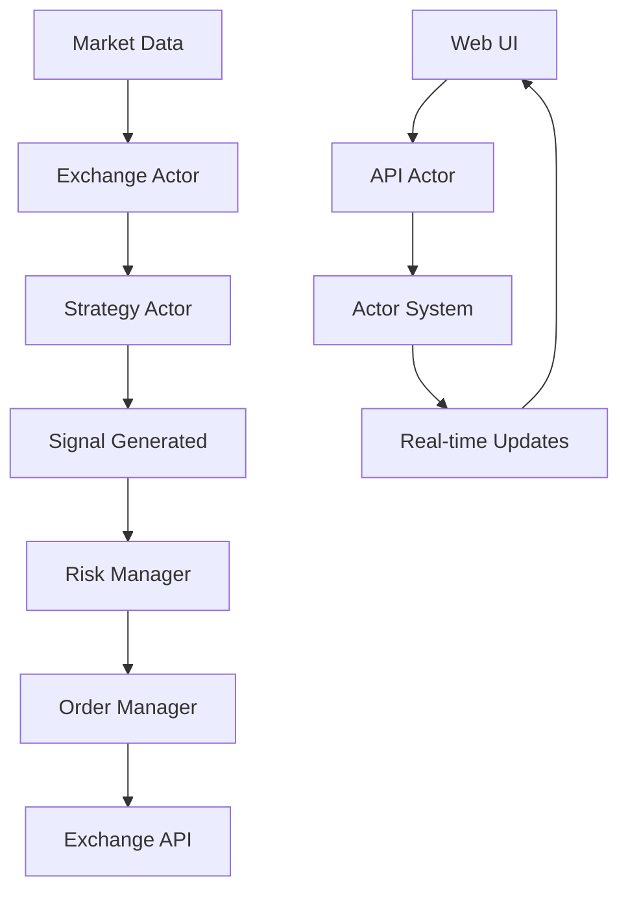

# MarketMaestro - Advanced Cryptocurrency Trading Bot

[](https://golang.org)
[](LICENSE)
[](https://github.com/anthdm/hollywood)

MarketMaestro is a sophisticated cryptocurrency trading bot built in Go using the Hollywood actor framework. It features a unique message-passing architecture, Starlark-based strategy scripting, and support for multiple cryptocurrency exchanges.

## 🚀 Key Features

### Core Architecture
- **🎭 Actor-Based Design**: Built on the Hollywood actor framework for robust message-passing architecture
- **🔄 Event-Driven**: Real-time processing of market data through WebSocket connections
- **🛡️ Fault Tolerant**: Isolated actor execution prevents cascading failures
- **📈 Scalable**: Easy horizontal scaling through actor distribution

### Trading Capabilities
- **📊 Multi-Exchange Support**: Unified interface for Bybit and Bitvavo exchanges
- **🐍 Starlark Strategy Engine**: Write trading strategies in Python-like syntax
- **📐 65+ Technical Indicators**: Comprehensive indicator library (SMA, EMA, RSI, MACD, Bollinger Bands, RVI, PPO, A/D Line, CMF, Linear Regression, etc.)
- **⚡ Real-Time Data**: Live market data feeds with kline, orderbook, and ticker support
- **🎯 Risk Management**: Built-in position sizing and risk controls
- **💼 Portfolio Tracking**: Real-time portfolio monitoring and P&L calculation

### Technology Stack
- **🌐 REST API**: Full-featured API with OpenAPI 3.0 specification
- **🖥️ Web Interface**: Modern, responsive UI with real-time updates
- **🗄️ Database**: SQLite with automated schema migrations
- **⚙️ Configuration**: Flexible YAML + environment variable configuration
- **📝 Structured Logging**: Comprehensive logging with zerolog

## 📋 Prerequisites

- **Go 1.24.4+** - [Download Go](https://golang.org/dl/)
- **Git** - For cloning the repository
- **Exchange API Keys** - Testnet keys recommended for development

### Supported Exchanges
- **Bybit** - Derivatives and spot trading
- **Bitvavo** - European cryptocurrency exchange

## 🛠️ Quick Start

### 1. Clone and Setup
```bash
git clone https://github.com/arijanluiken/marketmaestro.git
cd marketmaestro

# Install dependencies
go mod tidy
```

### 2. Configure Environment
```bash
# Copy environment template
cp .env.example .env

# Edit with your exchange credentials (use testnet for safety)
nano .env
```

### 3. Build and Run
```bash
# Build the application
go build -o bin/marketmaestro .

# Run the trading bot
./bin/marketmaestro
```

### 4. Access the Application
- **🌐 Web UI**: http://localhost:8081
- **🔧 API Health**: http://localhost:8080/api/v1/health  
- **📖 API Docs**: http://localhost:8080/api/v1/openapi.json

## 🏗️ Architecture

MarketMaestro uses a sophisticated actor-based architecture built on the Hollywood framework. This design ensures high reliability, scalability, and fault tolerance through message passing rather than shared state.

### Actor Hierarchy
```
🎭 Supervisor Actor (Root)
├── 🌐 API Actor (REST Server)
├── 🖥️ UI Actor (Web Interface)  
└── 🏦 Exchange Actors (Per Exchange)
    ├── 🧠 Strategy Actors (Trading Logic)
    ├── 📋 Order Manager Actor (Order Execution)
    ├── 🛡️ Risk Manager Actor (Risk Controls)
    ├── 💼 Portfolio Actor (Balance Tracking)
    └── ⚙️ Settings Actor (Configuration)
```

### Message Flow


### Key Design Principles
- **🔒 Isolation**: Each actor maintains its own state, preventing race conditions
- **📨 Message Passing**: All communication happens through immutable messages
- **🔄 Event-Driven**: Reactive system responding to market events
- **🛡️ Fault Tolerance**: Actor supervision ensures system resilience

## ⚙️ Configuration

MarketMaestro uses a dual configuration system combining environment variables for sensitive data and YAML for structural configuration.

### Environment Variables (.env)
**Create from template:**
```bash
cp .env.example .env
```

**Required Variables:**
```env
# Bybit Configuration (Recommended for testing)
BYBIT_API_KEY=your_bybit_api_key
BYBIT_SECRET=your_bybit_secret_key
BYBIT_TESTNET=true  # Use testnet for development

# Bitvavo Configuration
BITVAVO_API_KEY=your_bitvavo_api_key
BITVAVO_SECRET=your_bitvavo_secret_key
BITVAVO_TESTNET=true

# Server Configuration
API_PORT=8080
UI_PORT=8081
LOG_LEVEL=info

# Database
DATABASE_PATH=./marketmaestro.db
```

### Application Configuration (config.yaml)
```yaml
# Database settings
database:
  path: "./marketmaestro.db"

# API server configuration  
api:
  port: 8080
  timeout: 30s

# Web UI configuration
ui:
  port: 8081

# Logging configuration
logging:
  level: "info"

# Exchange configurations
exchanges:
  bybit:
    enabled: true
    pairs:
      - symbol: "BTCUSDT"
        strategies:
          - name: "simple_sma"
            config:
              short_period: 10
              long_period: 20
              position_size: 0.01
              interval: "1m"
      - symbol: "ETHUSDT"
        strategies:
          - name: "rsi_strategy"
            config:
              period: 14
              oversold: 30
              overbought: 70
              position_size: 0.005
              interval: "15m"
  
  bitvavo:
    enabled: false
    pairs:
      - symbol: "BTC-EUR"
        strategies:
          - name: "simple_sma"
            config:
              short_period: 12
              long_period: 26
              position_size: 0.01

# Global strategy settings
strategies:
  directory: "./strategy"
  default_interval: "1m"
  max_concurrent: 10
```

### ⚠️ Security Best Practices
- **Always use testnet** for development and testing
- **Store API keys securely** - never commit them to version control
- **Use environment-specific configurations** for different deployment stages
- **Regularly rotate API keys** and monitor exchange account activity

## 🐍 Strategy Development

MarketMaestro's strategy engine uses **Starlark** (Python-like syntax) for writing trading strategies. This provides a safe, sandboxed environment for strategy execution.

### Quick Strategy Example
Create a new file in `strategy/my_strategy.star`:

```python
# Strategy configuration
def settings():
    return {
        "interval": "1m",     # Required: Data interval
        "period": 14,         # Custom parameter
        "threshold": 0.02     # Custom parameter
    }

# Initialize strategy state
state = {
    "prices": [],
    "signals": []
}

# Required callback function
def on_kline(kline):
    """Called when new market data arrives"""
    # Add price to our buffer
    state["prices"].append(kline.close)
    
    # Keep only last 50 prices
    if len(state["prices"]) > 50:
        state["prices"] = state["prices"][-50:]
    
    # Simple moving average strategy
    if len(state["prices"]) >= config.get("period", 14):
        ma = sma(state["prices"], config.get("period", 14))[-1]
        current_price = kline.close
        
        # Buy signal: price above MA + threshold
        if current_price > ma * (1 + config.get("threshold", 0.02)):
            return {
                "action": "buy",
                "quantity": 0.01,
                "type": "market",
                "reason": f"Price {current_price} above MA {ma}"
            }
        
        # Sell signal: price below MA - threshold  
        elif current_price < ma * (1 - config.get("threshold", 0.02)):
            return {
                "action": "sell",
                "quantity": 0.01,
                "type": "market", 
                "reason": f"Price {current_price} below MA {ma}"
            }
    
    # No signal
    return {"action": "hold", "quantity": 0.0}

# Optional callback functions
def on_orderbook(orderbook):
    """Called when orderbook updates arrive"""
    return {"action": "hold", "quantity": 0.0}

def on_ticker(ticker):
    """Called when ticker updates arrive"""
    return {"action": "hold", "quantity": 0.0}
```

### Available Technical Indicators
MarketMaestro provides 25+ built-in technical indicators:

**Trend Indicators:**
- `sma(prices, period)` - Simple Moving Average
- `ema(prices, period)` - Exponential Moving Average
- `wma(prices, period)` - Weighted Moving Average
- `macd(prices, fast, slow, signal)` - MACD Oscillator

**Momentum Indicators:**  
- `rsi(prices, period)` - Relative Strength Index
- `stoch(highs, lows, closes, k_period)` - Stochastic Oscillator
- `williams_r(highs, lows, closes, period)` - Williams %R

**Volatility Indicators:**
- `bollinger_bands(prices, period, std_dev)` - Bollinger Bands
- `atr(highs, lows, closes, period)` - Average True Range
- `keltner_channels(highs, lows, closes, period)` - Keltner Channels

**Volume Indicators:**
- `obv(closes, volumes)` - On-Balance Volume
- `mfi(highs, lows, closes, volumes, period)` - Money Flow Index

### Strategy Development Workflow
1. **📝 Write Strategy**: Create `.star` file in `strategy/` directory
2. **⚙️ Configure**: Add strategy to `config.yaml` under exchange pairs
3. **🧪 Test**: Use testnet environment for safe testing
4. **📊 Monitor**: Check logs and web UI for strategy performance
5. **🔧 Iterate**: Refine strategy based on results

### Best Practices
- **Start Simple**: Begin with basic strategies before adding complexity
- **Use Testnet**: Always test strategies with testnet before live trading
- **Log Everything**: Use `log()` function to track strategy decisions
- **Manage Risk**: Implement proper position sizing and stop losses
- **Backtest**: Validate strategies with historical data when possible

## 🔌 API Reference

MarketMaestro provides a comprehensive REST API with OpenAPI 3.0 specification for programmatic access.

### Core Endpoints

| Method | Endpoint | Description |
|--------|----------|-------------|
| `GET` | `/api/v1/health` | System health check |
| `GET` | `/api/v1/openapi.json` | OpenAPI specification |
| `GET` | `/api/v1/exchanges` | List configured exchanges |
| `GET` | `/api/v1/strategies` | List active strategies |
| `GET` | `/api/v1/portfolio` | Portfolio summary |
| `GET` | `/api/v1/orders` | Order history |
| `POST` | `/api/v1/orders` | Place manual order |

### Example API Usage
```bash
# Check system health
curl http://localhost:8080/api/v1/health

# Get portfolio information
curl http://localhost:8080/api/v1/portfolio

# List active strategies
curl http://localhost:8080/api/v1/strategies
```

### Response Format
All API responses follow a consistent JSON format:
```json
{
  "status": "success",
  "data": {
    // Response data here
  },
  "timestamp": "2024-01-15T10:30:00Z"
}
```

### Error Handling
Error responses include detailed information:
```json
{
  "status": "error",
  "error": {
    "code": "INVALID_SYMBOL",
    "message": "Symbol BTCUSDT not found",
    "details": {}
  },
  "timestamp": "2024-01-15T10:30:00Z"
}
```

## 🖥️ Web Interface

The web interface provides real-time monitoring and control of your trading bot:

### Features
- **📊 Live Dashboard**: Real-time portfolio and P&L tracking
- **📈 Price Charts**: Interactive candlestick charts with indicators
- **📋 Order Management**: View and manage active orders
- **🧠 Strategy Monitor**: Track strategy performance and signals
- **⚙️ Configuration**: Modify settings without restart
- **📜 Activity Logs**: Real-time log streaming

### Screenshots
*Access the web interface at http://localhost:8081 after starting the bot*

## 🧪 Testing

### Run Tests
```bash
# Run all tests
go test ./...

# Run tests with coverage
go test -cover ./...

# Run strategy-specific tests
go test ./internal/strategy/...
```

### Testing Strategies
MarketMaestro includes a strategy testing framework:

```bash
# Test a specific strategy file
go run . -test-strategy strategy/simple_sma.star

# Backtest with historical data
go run . -backtest -symbol BTCUSDT -start 2024-01-01 -end 2024-01-31
```

## 🚀 Deployment

### Production Deployment
1. **Build optimized binary:**
   ```bash
   CGO_ENABLED=1 GOOS=linux go build -ldflags="-s -w" -o marketmaestro .
   ```

2. **Use production environment:**
   ```bash
   # Set production environment variables
   export BYBIT_TESTNET=false
   export LOG_LEVEL=warn
   
   # Run with production config
   ./marketmaestro
   ```

3. **Process management:**
   ```bash
   # Using systemd (recommended)
   sudo systemctl enable marketmaestro
   sudo systemctl start marketmaestro
   
   # Or using screen/tmux
   screen -S marketmaestro ./marketmaestro
   ```

### Docker Deployment
```dockerfile
FROM golang:1.24.4-alpine AS builder
WORKDIR /app
COPY . .
RUN go build -o marketmaestro .

FROM alpine:latest
RUN apk --no-cache add ca-certificates
WORKDIR /root/
COPY --from=builder /app/marketmaestro .
COPY --from=builder /app/config.yaml .
CMD ["./marketmaestro"]
```

### Environment Variables for Production
```env
# Set to false for live trading
BYBIT_TESTNET=false
BITVAVO_TESTNET=false

# Production logging
LOG_LEVEL=warn

# Secure database path
DATABASE_PATH=/data/marketmaestro.db
```

## 🔧 Troubleshooting

### Common Issues

#### Build Issues
**Problem**: `go build` fails with missing dependencies
```bash
# Solution: Clean and reinstall dependencies
go clean -modcache
go mod tidy
go mod download
```

**Problem**: SQLite compilation errors
```bash
# Solution: Install SQLite development headers
# Ubuntu/Debian:
sudo apt-get install sqlite3 libsqlite3-dev

# macOS:
brew install sqlite3

# Alpine Linux:
apk add sqlite sqlite-dev
```

#### Runtime Issues
**Problem**: "Connection refused" to exchange APIs
- **Check**: Internet connectivity and firewall settings
- **Verify**: API keys are correct and active
- **Ensure**: Testnet URLs are accessible

**Problem**: Database migration failures
```bash
# Solution: Reset database (⚠️ will lose data)
rm marketmaestro.db
./marketmaestro  # Will recreate database
```

**Problem**: Actor system not starting
- **Check**: Port availability (8080, 8081)
- **Verify**: Configuration file syntax (`config.yaml`)
- **Review**: Application logs for specific error messages

#### Strategy Issues
**Problem**: Strategy not executing
- **Verify**: Strategy file syntax is valid Starlark
- **Check**: Strategy is configured in `config.yaml`
- **Ensure**: Exchange is enabled and connected

**Problem**: Indicators returning errors
- **Check**: Sufficient historical data (need minimum periods)
- **Verify**: Input data types are correct (floats, not strings)
- **Review**: Indicator documentation for parameter requirements

### Debug Mode
Enable verbose logging for troubleshooting:
```bash
# Set debug logging
export LOG_LEVEL=debug
./marketmaestro

# Or modify config.yaml
logging:
  level: "debug"
```

### Getting Help
- **📖 Documentation**: Check [docs/strategy-engine.md](docs/strategy-engine.md)
- **🐛 Issues**: Report bugs at [GitHub Issues](https://github.com/arijanluiken/marketmaestro/issues)
- **💬 Discussions**: Join discussions at [GitHub Discussions](https://github.com/arijanluiken/marketmaestro/discussions)

## 🤝 Contributing

We welcome contributions! Here's how to get started:

### Development Setup
1. **Fork the repository**
2. **Clone your fork:**
   ```bash
   git clone https://github.com/yourusername/marketmaestro.git
   cd marketmaestro
   ```

3. **Create feature branch:**
   ```bash
   git checkout -b feature/your-feature-name
   ```

4. **Install dependencies:**
   ```bash
   go mod tidy
   ```

### Code Guidelines
- **Follow Go conventions**: Use `gofmt`, `golint`, and `go vet`
- **Write tests**: Include unit tests for new features
- **Document changes**: Update README and docs as needed
- **Actor patterns**: Use message passing, avoid shared state
- **Error handling**: Use structured logging with context

### Testing Your Changes
```bash
# Run all tests
go test ./...

# Test build
go build -o bin/marketmaestro .

# Test with testnet
export BYBIT_TESTNET=true
./bin/marketmaestro
```

### Submitting Changes
1. **Commit changes:**
   ```bash
   git add .
   git commit -m "feat: add new feature description"
   ```

2. **Push to your fork:**
   ```bash
   git push origin feature/your-feature-name
   ```

3. **Create Pull Request**: Open PR against the main repository

### Contribution Areas
- **🧠 New Strategies**: Implement new trading algorithms
- **📊 Technical Indicators**: Add new indicators to the library
- **🏦 Exchange Support**: Integrate additional exchanges
- **🎨 UI Improvements**: Enhance the web interface
- **📚 Documentation**: Improve docs and examples
- **🧪 Testing**: Expand test coverage

## 📚 Documentation

### Core Documentation
- **[Strategy Engine Guide](docs/strategy-engine.md)** - Comprehensive strategy development guide
- **[API Reference](http://localhost:8080/api/v1/openapi.json)** - Complete API documentation
- **[CHANGELOG](CHANGELOG.md)** - Version history and changes

### Architecture Deep Dive
- **Actor System**: Hollywood framework message passing
- **Exchange Interface**: Unified API abstraction
- **Strategy Engine**: Starlark scripting environment
- **Risk Management**: Position sizing and controls
- **Database Design**: SQLite schema and migrations

## 📊 Project Status

### ✅ Completed Features
- **🎭 Core actor system** with message passing
- **🏦 Exchange interface** and factory pattern  
- **🌐 REST API** with Chi router and OpenAPI
- **🖥️ Web UI** with embedded assets
- **🗄️ Database** with automated migrations
- **⚙️ Configuration** management system
- **📝 Structured logging** with zerolog
- **🐍 Starlark strategy engine** with 25+ indicators
- **📊 Technical indicators** library
- **⚡ Real-time data** processing

### 🚧 In Progress
- **🔌 WebSocket** data feeds optimization
- **🏦 Complete exchange** implementations
- **📋 Advanced order types** (OCO, trailing stops)
- **📊 Real-time portfolio** tracking enhancements
- **🧪 Backtesting** framework
- **📱 Mobile-friendly** UI

### 🎯 Planned Features
- **🤖 Machine learning** integration
- **📈 Advanced charting** with TradingView
- **🔔 Alert system** (email, SMS, webhooks)
- **🌍 Multi-region** deployment
- **💾 Cloud storage** integration
- **🔐 Enhanced security** features

## 📄 License

This project is licensed under the **MIT License** - see the [LICENSE](LICENSE) file for details.

### MIT License Summary
- ✅ **Commercial use** allowed
- ✅ **Modification** allowed  
- ✅ **Distribution** allowed
- ✅ **Private use** allowed
- ❗ **Liability** not provided
- ❗ **Warranty** not provided

## 👨‍💻 Author

**Arijan Luiken**
- GitHub: [@arijanluiken](https://github.com/arijanluiken)

## ⚠️ Disclaimer

**IMPORTANT**: This software is for educational and research purposes. Cryptocurrency trading involves substantial risk of financial loss. 

- **🧪 Use testnet**: Always test strategies before live trading
- **💰 Risk management**: Never invest more than you can afford to lose
- **📚 DYOR**: Do your own research before making trading decisions
- **⚖️ Legal compliance**: Ensure compliance with local financial regulations

The authors are not responsible for any financial losses incurred from using this software.

---

<div align="center">

**⭐ Star this project if you find it useful!**

[🐛 Report Bug](https://github.com/arijanluiken/marketmaestro/issues) • [✨ Request Feature](https://github.com/arijanluiken/marketmaestro/issues) • [💬 Discussions](https://github.com/arijanluiken/marketmaestro/discussions)

</div>